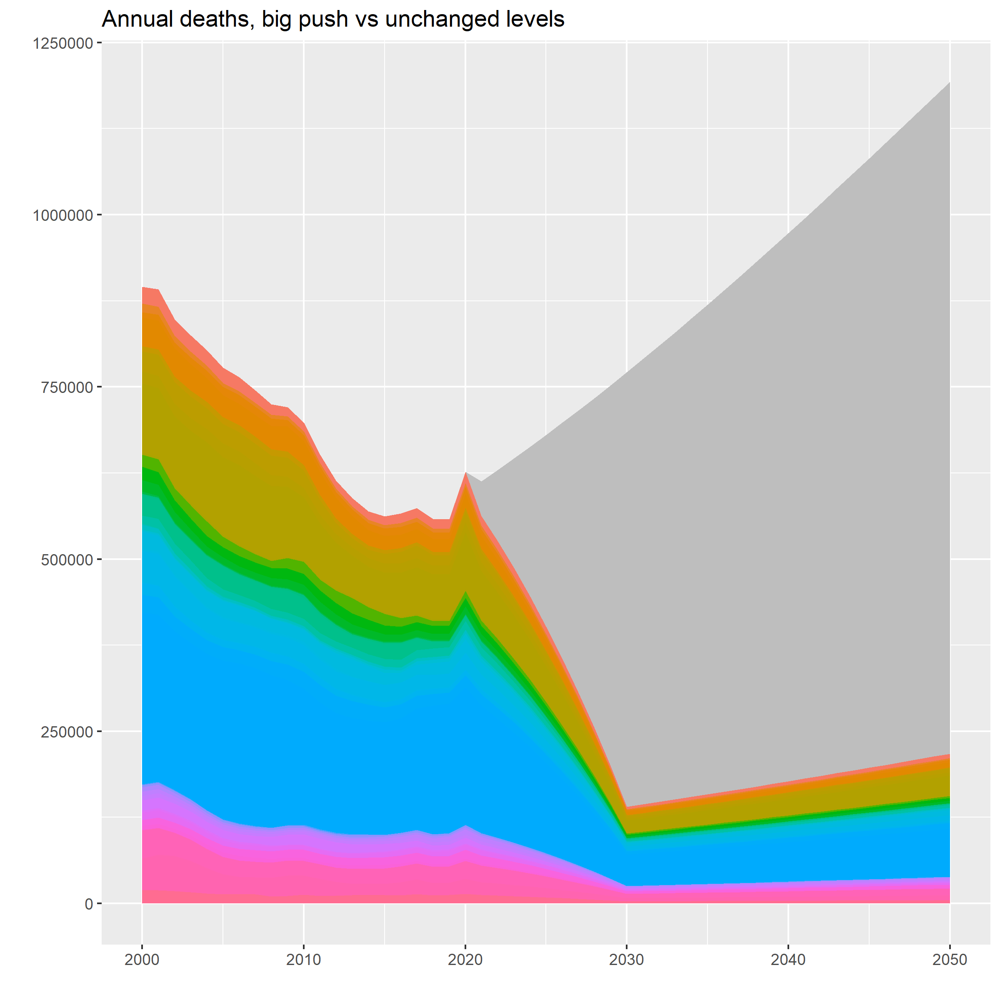

## Replication data and code for:
# Squashing malaria could save as many lives as covid-19 has taken 
Available here: https://www.economist.com/graphic-detail/2022/03/19/squashing-malaria-could-save-as-many-lives-as-covid-19-has-taken

Two scenarios for Malaria, 2010-2050. Note the big effect of population change in malarious countries, which causes deaths to increase if the levels stay the same. Note also that the "big push" scenario is optimistic in the sense that it represents a plausible effect of a 'big push': a scale-up of existing intervention together with new vaccines and mosquito-fighting techniques. Even a continuation of current levels would require effort, as the malaria burden levels could increase, too. 
   
   
 <!---

Plasmodium falciparum incidence in Sub-Saharan Africa, 2019. (Source: https://malariaatlas.org/)

Estimated impact of 75% reduction in malaria burden (by 2030), 2022-2042 (Source: The Economist)    
---> 
  
    
## Sources:
* **Population estimates and projections:** United Nations Department of Economic and Social Affairs (https://population.un.org/wpp/Download/Standard/Population/)
* **Malaria burden**: World malaria report (2021), statistical annex F (https://www.who.int/publications/i/item/9789240040496 and https://cdn.who.int/media/docs/default-source/malaria/world-malaria-reports/wmr2021-excel-annexes.zip?sfvrsn=74759e4f_5)
